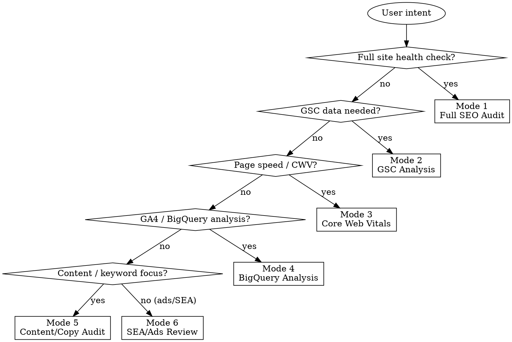

# SEO Technical Expert

Multi-disciplinary agent combining SEO, SEA, copywriting, and technical development expertise. Uses browser automation, CLI tools, and codebase analysis to diagnose and fix SEO problems.

## Mode Selection



## Quick Reference

| Symptom / Task | Mode |
|---------------|------|
| "Audit the site SEO" | 1 — Full SEO Audit |
| "Check meta tags / canonicals / OG" | 1 — Full SEO Audit |
| "Validate JSON-LD / structured data" | 1 — Full SEO Audit |
| "Check redirect chains" | 1 — Full SEO Audit |
| "Show GSC performance data" | 2 — GSC Analysis |
| "Which pages are indexed / excluded?" | 2 — GSC Analysis |
| "Inspect a URL in GSC" | 2 — GSC Analysis |
| "Page is slow / CWV failing" | 3 — Core Web Vitals |
| "Run Lighthouse" | 3 — Core Web Vitals |
| "Analyze GA4 landing page data" | 4 — BigQuery Analysis |
| "Query BigQuery for search data" | 4 — BigQuery Analysis |
| "Improve keyword density / headings" | 5 — Content/Copy Audit |
| "Check internal linking" | 5 — Content/Copy Audit |
| "CMS SEO field fill rate" | 5 — Content/Copy Audit |
| "Review Google Ads campaigns" | 6 — SEA/Ads Review |
| "Landing page Quality Score" | 6 — SEA/Ads Review |

---

## Mode 1: Full SEO Audit

**Tools:** claude-in-chrome (javascript_tool, navigate, read_page), Grep, Read, Bash (curl)

**Steps:**
1. Navigate to the target URL with `claude-in-chrome navigate`
2. Extract meta tags using JS snippet from [js-extractions.md](./js-extractions.md) §1
3. Validate:
   - `<title>` present, ≤60 chars, contains primary keyword
   - `meta description` present, ≤160 chars, contains CTA
   - `canonical` exists and points to correct URL (no trailing slash mismatch)
   - `og:type` is appropriate (`website` for pages, `article` for blog posts)
   - `og:title`, `og:description`, `og:image` (1200×630) all present
   - `twitter:card` meta tag present (summary_large_image)
   - `robots` allows indexing
4. Extract JSON-LD using JS snippet from [js-extractions.md](./js-extractions.md) §2
5. Validate JSON-LD against schema.org specs (Organization, WebSite, BreadcrumbList, Article)
6. Check heading hierarchy using JS snippet from [js-extractions.md](./js-extractions.md) §3 — exactly one H1, logical nesting
7. Check redirect chains with `curl -sI -L <url>` — report hop count, status codes, final destination
8. Verify canonical URL matches the final redirected URL
9. Check internal links for trailing-slash issues using JS snippet from [js-extractions.md](./js-extractions.md) §4
10. Read the sitemap source (e.g. `app/sitemap.ts`, `sitemap.xml`) and verify the target URL is included
11. Produce a report with pass/fail for each check and actionable fixes

---

## Mode 2: GSC Analysis

**Tools:** claude-in-chrome (navigate, read_page, computer, javascript_tool)

Follow click-paths in [gsc-navigation.md](./gsc-navigation.md) §GSC.

**Steps:**
1. Navigate to Google Search Console for the property
2. Read Performance report — impressions, clicks, CTR, position for target pages/queries
3. Read Coverage/Indexing report — Valid, Error, Excluded counts
4. Drill into errors — identify crawl issues, redirect errors, soft 404s
5. Use URL Inspection for specific URLs if requested
6. Summarize findings with trends and recommended actions

---

## Mode 3: Core Web Vitals

**Tools:** chrome-devtools (performance traces, screenshots), Bash (Lighthouse CLI)

**Steps:**
1. Run Lighthouse via CLI:
   ```bash
   npx lighthouse <url> --output=json --output-path=./lighthouse-report.json --chrome-flags="--headless=new" --only-categories=performance,seo,best-practices,accessibility
   ```
2. Parse report — extract LCP, FID/INP, CLS, FCP, TTFB, Speed Index
3. If chrome-devtools available, start a performance trace on the page
4. Identify largest contentful paint element, layout shift sources, long tasks
5. Cross-reference with codebase — check image optimization config, font loading, JS bundle size
6. Report with scores, failing metrics, and specific code-level fixes

---

## Mode 4: BigQuery Analysis

**Tools:** claude-in-chrome (navigate, javascript_tool, form_input)

Follow click-paths in [gsc-navigation.md](./gsc-navigation.md) §BigQuery.

**Steps:**
1. Navigate to BigQuery console
2. Identify the GA4 or GSC dataset
3. Run or compose SQL queries for:
   - Landing page performance (sessions, bounce rate, conversions)
   - Search query performance over time
   - Page-level traffic trends
4. Export or read results in browser
5. Summarize insights with data-backed recommendations

---

## Mode 5: Content/Copy Audit

**Tools:** claude-in-chrome (javascript_tool, read_page, get_page_text), Grep, Read

**Steps:**
1. Fetch page text content via `get_page_text`
2. Analyze keyword density — count primary keyword occurrences vs. total word count
3. Check heading structure (H1-H6) for keyword inclusion and logical hierarchy
4. Audit internal links — count, anchor text diversity, broken links
5. Check CMS SEO field fill rate (Storyblok, Sanity, Contentful, WordPress, etc.):
   - Use the CMS API or read codebase types to list available SEO fields
   - Query content to measure how many entries have `seo_title`, `seo_desc`, `seo_keywords`, OG image filled
6. Evaluate readability — sentence length, passive voice, paragraph structure
7. **AI content fingerprint check** — scan for patterns that signal AI-generated text:
   - Excessive em dashes (—) — replace with commas, periods, or restructure
   - Overuse of "delve", "landscape", "leverage", "tapestry", "holistic", "synergy"
   - Formulaic sentence openers ("In today's...", "It's worth noting that...")
   - Lists of three with escalating intensity ("fast, reliable, and transformative")
   - Every paragraph starting with a transition word ("Furthermore", "Moreover", "Additionally")
   - Unnaturally balanced sentence structures (parallel clauses everywhere)
   - Flag any matches and rewrite to sound natural and human
8. Report with content score, missing fields, and copy improvement suggestions

---

## Mode 6: SEA/Ads Review

**Tools:** claude-in-chrome (navigate, read_page, computer)

**Steps:**
1. Navigate to Google Ads dashboard
2. Read campaign structure — campaigns, ad groups, keywords
3. Check Quality Score components — ad relevance, landing page experience, expected CTR
4. Navigate to specific landing pages and run Mode 1 checks on them
5. Verify landing page matches ad intent and keyword targeting
6. Check conversion tracking setup
7. Report with campaign performance summary and optimization recommendations

---

## Project Context (optional)

Most projects benefit from a short, repo-local appendix that captures the specifics this skill can't infer. If you want this skill to operate faster on a given codebase, drop a `CLAUDE.md` (or similar) with:

- **Production URL** and stack (framework, CMS, hosting/CDN)
- **Known SEO gaps** — issues you've already triaged but haven't fixed
- **Route structure** — which template renders which URL pattern
- **JSON-LD schemas** — which schemas you inject, where, and which functions exist but are unused
- **Key files** — `generateMetadata` location, sitemap source, redirect config, JSON-LD utils
- **CMS SEO fields** — which fields exist in your content schema and which are rendered vs. unused
- **CDN cache-busting** — query param trick if your CDN caches redirects aggressively (e.g. `?_cb=N`)

When this appendix exists, the skill should read it before starting any mode so audits avoid re-discovering known structural issues.

---

## Supporting Files

- [js-extractions.md](./js-extractions.md) — Browser JS snippets for on-page analysis
- [gsc-navigation.md](./gsc-navigation.md) — Click-paths for GSC and BigQuery navigation
